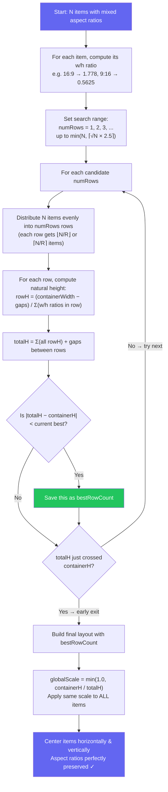

<p align="center">
  
  
  
  
</p>

<h1 align="center">Meeting Grid Layout</h1>

<p align="center">
  A modern, responsive grid library for video meeting layouts with smooth Motion animations.
  <br />
  Works with Vanilla JS, React, and Vue.
</p>

<p align="center">
  <a href="#demos">Demos</a> ·
  <a href="#features">Features</a> ·
  <a href="#packages">Packages</a> ·
  <a href="#installation">Installation</a> ·
  <a href="#quick-start">Quick Start</a> ·
  <a href="#layout-modes">Layout Modes</a> ·
  <a href="#api-reference">API Reference</a> ·
  <a href="#license">License</a>
</p>

<p align="center">
  <a href="./README.vi.md">Tiếng Việt</a>
</p>

---

## Demos

- [React Demo](https://meeting-react-grid.modern-ui.org/)
- [Vue Demo](https://meeting-vue-grid.modern-ui.org/)

---

## Features

| Feature                     | Description                                            |
| --------------------------- | ------------------------------------------------------ |
| **2 Layout Modes**          | Gallery (with optional Pin mode), Spotlight            |
| **Pin/Focus Support**       | Pin any participant to become the main view            |
| **Spring Animations**       | Smooth Motion (Framer Motion / Motion One) transitions |
| **Pagination**              | Split participants across pages with navigation        |
| **Max Visible + "+N More"** | Limit visible items and show overflow indicator        |
| **Flexible Aspect Ratios**  | Per-item ratios (phone 9:16, desktop 16:9)             |
| **Floating PiP**            | Draggable Picture-in-Picture with corner snapping      |
| **Pin Only Mode**           | Mobile/tablet pin view with separate pagination        |
| **Grid Overlay**            | Full-grid overlay for screen sharing, whiteboard, etc. |
| **Responsive**              | Adapts to container size with justified packing        |
| **Framework Support**       | Vanilla JS, React 18+, Vue 3                           |
| **TypeScript**              | Full type definitions                                  |
| **Tree-shakeable**          | Import only what you need                              |

---

## Packages

| Package                                                                                                        | Description                    | Size |
| -------------------------------------------------------------------------------------------------------------- | ------------------------------ | ---- |
| [`@thangdevalone/meeting-grid-layout-core`](https://www.npmjs.com/package/@thangdevalone/meeting-grid-layout-core)   | Grid math only (Vanilla JS/TS) | ~3KB |
| [`@thangdevalone/meeting-grid-layout-react`](https://www.npmjs.com/package/@thangdevalone/meeting-grid-layout-react) | React components + Motion      | ~8KB |
| [`@thangdevalone/meeting-grid-layout-vue`](https://www.npmjs.com/package/@thangdevalone/meeting-grid-layout-vue)     | Vue 3 components + Motion      | ~8KB |

> React and Vue packages re-export everything from core — no need to install core separately.

---

## Installation

```bash
# Core only (Vanilla JavaScript/TypeScript)
npm install @thangdevalone/meeting-grid-layout-core

# React 18+
npm install @thangdevalone/meeting-grid-layout-react

# Vue 3
npm install @thangdevalone/meeting-grid-layout-vue
```

---

## Quick Start

### React

```tsx
import { GridContainer, GridItem } from '@thangdevalone/meeting-grid-layout-react'

function MeetingGrid({ participants }) {
  return (
    <GridContainer aspectRatio="16:9" gap={8} layoutMode="gallery" count={participants.length}>
      {participants.map((p, index) => (
        <GridItem key={p.id} index={index}>
          <VideoTile participant={p} />
        </GridItem>
      ))}
    </GridContainer>
  )
}
```

### Vue 3

```vue
<script setup>
import { GridContainer, GridItem } from '@thangdevalone/meeting-grid-layout-vue'

const participants = ref([...])
</script>

<template>
  <GridContainer aspect-ratio="16:9" :gap="8" :count="participants.length" layout-mode="gallery">
    <GridItem v-for="(p, index) in participants" :key="p.id" :index="index">
      <VideoTile :participant="p" />
    </GridItem>
  </GridContainer>
</template>
```

### Vanilla JavaScript

```javascript
import { createMeetGrid } from '@thangdevalone/meeting-grid-layout-core'

const grid = createMeetGrid({
  dimensions: { width: 800, height: 600 },
  count: 6,
  aspectRatio: '16:9',
  gap: 8,
  layoutMode: 'gallery',
})

for (let i = 0; i < 6; i++) {
  const { top, left } = grid.getPosition(i)
  const { width, height } = grid.getItemDimensions(i)

  element.style.cssText = `
    position: absolute;
    top: ${top}px;
    left: ${left}px;
    width: ${width}px;
    height: ${height}px;
  `
}
```

---

## Layout Modes

| Mode        | Description                                                 |
| ----------- | ----------------------------------------------------------- |
| `gallery`   | Flexible grid filling all space. Use `pinnedIndex` for pin. |
| `spotlight` | Single participant fills the entire container.              |

### Gallery with Pin

When `pinnedIndex` is set, the layout splits into a **Focus Area** (pinned item) and an **Others Area** (thumbnails):

```tsx
<GridContainer
  layoutMode="gallery"
  pinnedIndex={0}              // Pinned participant
  othersPosition="right"       // Others on the right
  count={participants.length}
>
```

| `othersPosition` | Description                                |
| ---------------- | ------------------------------------------ |
| `right`          | Thumbnails on the right (default)          |
| `left`           | Thumbnails on the left                     |
| `top`            | Thumbnails on top (horizontal strip)       |
| `bottom`         | Thumbnails on bottom (speaker-like layout) |

### Pin Only Mode

On mobile/tablet devices (container width ≤ 1024px), `pinOnly` provides a focused experience:

- **Page 0:** Only the pinned participant is shown full-screen
- **Page 1+:** Other participants are shown in a gallery grid (without pin)

On desktop (width > 1024px), the layout behaves as a normal sidebar.

```tsx
// React
<GridContainer
  layoutMode="gallery"
  pinnedIndex={0}
  maxVisible={4}
  currentVisiblePage={currentPage}
  pinOnly={true}
>
```

```vue
<!-- Vue -->
<GridContainer
  layout-mode="gallery"
  :pinned-index="0"
  :max-visible="4"
  :current-visible-page="currentPage"
  :pin-only="true"
>
```

> **Note:** `pinOnly` requires pagination (`maxVisible > 0`) to work. The total pages = 1 (pin page) + ceil(others / maxVisible).

---

## Pagination

Split participants across multiple pages:

```tsx
<GridContainer
  count={participants.length}
  maxItemsPerPage={9}
  currentPage={currentPage}
>
```

For pin mode, use `maxVisible` and `currentVisiblePage` to paginate the "others" area:

```tsx
<GridContainer
  layoutMode="gallery"
  pinnedIndex={0}
  maxVisible={4}
  currentVisiblePage={othersPage}
>
```

---

## Max Visible with "+N More"

Limit visible items and show an overflow indicator:

```tsx
<GridContainer maxVisible={4} count={12}>
  {participants.map((p, index) => (
    <GridItem key={p.id} index={index}>
      {({ isLastVisibleOther, hiddenCount }) => (
        <>
          {isLastVisibleOther && hiddenCount > 0 ? (
            <div className="more-indicator">+{hiddenCount} more</div>
          ) : (
            <VideoTile participant={p} />
          )}
        </>
      )}
    </GridItem>
  ))}
</GridContainer>
```

---

## Flexible Aspect Ratios

Support different aspect ratios per participant (e.g., mobile portrait vs desktop landscape):

```tsx
const itemAspectRatios = [
  "16:9",    // Desktop landscape
  "9:16",    // Mobile portrait
  undefined, // Use global aspectRatio
]

<GridContainer
  aspectRatio="16:9"
  itemAspectRatios={itemAspectRatios}
>
```

| Value       | Description                                           |
| ----------- | ----------------------------------------------------- |
| `"16:9"`    | Fixed landscape ratio                                 |
| `"9:16"`    | Portrait video (mobile)                               |
| `"4:3"`     | Classic tablet ratio                                  |
| `"auto"`    | Stretch to fill the cell (default when not specified) |
| `undefined` | Use global `aspectRatio`                              |

### How the Flexible Gallery Algorithm Works

When participants have **mixed aspect ratios** (e.g., some on phones with 9:16, others on desktops with 16:9), the grid uses an **Optimal Row Search** algorithm to find the layout that minimizes wasted space while preserving correct aspect ratios.

#### The Problem with Greedy Packing

A naive approach packs items row-by-row until a row is "full", then starts a new row. This often creates **imbalanced layouts** — for example, 10 items could end up as `[4, 5, 1]`, leaving the last row with a single lonely item and lots of wasted space.

Our algorithm avoids this by **trying multiple row counts** and picking the one that fills the container best.

#### Algorithm Flowchart



#### Step-by-Step

1. **Compute w/h ratios** — For each item, convert its aspect ratio string to a numeric width/height ratio:
   - `16:9` → `1.778` (wide landscape)
   - `9:16` → `0.5625` (tall portrait)
   - `4:3` → `1.333`, `1:1` → `1.0`

2. **Set the search range** — Try every row count from `1` up to `min(N, ⌈√N × 2.5⌉)`. Skip any row count where `⌊N/numRows⌋ = 0` (would leave empty rows).

3. **Even distribution** — For each candidate `numRows`, items are split evenly:
   - `base = ⌊N / numRows⌋`, `extra = N % numRows`
   - First `extra` rows get `base + 1` items, remaining rows get `base` items
   - Example: 9 items into 2 rows → `[5, 4]`; into 4 rows → `[3, 2, 2, 2]`

4. **Compute natural height per row** — If a row of items fills the full container width, how tall would it be?
   ```
   rowHeight = (containerWidth − (itemsInRow − 1) × gap) / Σ(w/h ratios of items in row)
   ```
   Rows with tall/portrait items produce larger heights; rows with wide/landscape items produce smaller heights.

5. **Total height & best fit** — Sum all row heights + gaps. The row count where `|totalH − containerH|` is **smallest** wins — this means the final scale factor will be closest to `1.0` (least wasted space).

6. **Early exit** — As `numRows` increases, `totalH` generally increases too. Once `totalH` crosses from below `containerH` to above it, the optimal is already recorded — stop searching.

7. **Uniform scaling** — Apply a single scale factor `globalScale = min(1.0, containerH / totalH)` to **all** items equally. Because width and height scale by the same factor, every item's aspect ratio is **perfectly preserved**.

8. **Center & position** — Each row is centered horizontally, and the entire grid is centered vertically in any remaining space.

#### Why `√N × 2.5` as the Upper Bound?

The search range `⌈√N × 2.5⌉` is carefully chosen:

- **`√N` gives the "square-ish" baseline.** For N items in a regular grid, `√N` rows × `√N` columns is the natural starting point. For example, 9 items → 3×3, 16 items → 4×4.

- **Mixed aspect ratios may need more rows.** When all items are tall/portrait (e.g., 9:16), fitting them side by side uses lots of column space — you might need significantly more rows than `√N` to utilize the container height well.

- **The `2.5×` multiplier provides enough headroom.** It allows the search to go well beyond the square-root baseline to handle portrait-heavy mixes, without being wasteful:

  | N (items) | √N   | ⌈√N × 2.5⌉ | Max rows tried |
  | --------- | ---- | ----------- | -------------- |
  | 4         | 2.0  | 5           | 4 (capped at N)|
  | 9         | 3.0  | 8           | 8              |
  | 16        | 4.0  | 10          | 10             |
  | 25        | 5.0  | 13          | 13             |
  | 50        | 7.07 | 18          | 18             |

- **`min(N, ...)` caps the maximum.** You never need more rows than items. For small N (e.g., 4 items), `⌈√4 × 2.5⌉ = 5` is capped at `4`.

- **Combined with early exit**, the actual iterations are typically far fewer — the search stops as soon as `totalH` crosses `containerH`, which often happens within the first few candidates.

#### Before vs After

<p align="center">
  
</p>

#### Visual Example: 9 Items with Mixed Ratios

```
Container: 1200 × 700px
Items: 16:9, 9:16, 4:3, 1:1, 16:9, 9:16, 4:3, 1:1, 16:9
Search range: 1 to min(9, ⌈√9 × 2.5⌉) = min(9, 8) = 8

Row count search:
┌──────────────────────────────────────────────────────────────────────┐
│ Rows=1: [9]           totalH =  152px  │ |152−700| = 548  ❌       │
│ Rows=2: [5, 4]        totalH =  680px  │ |680−700| =  20  ✅ Best  │
│ Rows=3: [3, 3, 3]     totalH = 1050px  │ |1050−700| = 350 ❌       │
│ → totalH crossed 700 (from 680→1050) → EARLY EXIT                  │
└──────────────────────────────────────────────────────────────────────┘

Winner: 2 rows [5, 4]
  globalScale = min(1.0, 700 / 680) = 1.0
  → Items fill 97% of container, every aspect ratio perfectly preserved
```

#### Performance

| Metric          | Value                                                          |
| --------------- | -------------------------------------------------------------- |
| Time complexity | `O(N × √N)` — N items × up to √N×2.5 candidates (with early exit) |
| Space           | `O(N)` — only the winning distribution is allocated            |
| Search phase    | Zero allocations — pure arithmetic on ratio array              |
| Typical speed   | < 0.1ms for 50 participants                                    |
| Early exit      | Stops as soon as `totalH` crosses `containerH`                 |

---

## Floating PiP (Picture-in-Picture)

Draggable floating item with corner snapping. Supports fixed or responsive sizing.

```tsx
import { FloatingGridItem, DEFAULT_FLOAT_BREAKPOINTS } from '@thangdevalone/meeting-grid-layout-react'

<GridContainer>
  {/* Main grid items */}

  {/* Fixed size */}
  <FloatingGridItem width={130} height={175} anchor="bottom-right">
    <VideoTile participant={floatingParticipant} />
  </FloatingGridItem>

  {/* Responsive — auto-adjusts based on container width */}
  <FloatingGridItem breakpoints={DEFAULT_FLOAT_BREAKPOINTS}>
    <VideoTile />
  </FloatingGridItem>
</GridContainer>

{/* Auto-float in 2-person mode */}
<GridContainer count={2} floatBreakpoints={DEFAULT_FLOAT_BREAKPOINTS}>
  {participants.map((p, i) => (
    <GridItem key={p.id} index={i}><VideoTile participant={p} /></GridItem>
  ))}
</GridContainer>

{/* Choose which participant is the floating PiP */}
<GridContainer count={2} floatBreakpoints={DEFAULT_FLOAT_BREAKPOINTS} pipIndex={0}>
  {participants.map((p, i) => (
    <GridItem key={p.id} index={i}><VideoTile participant={p} /></GridItem>
  ))}
</GridContainer>
```

### Default Breakpoints

| Container Width | PiP Size  |
| --------------- | --------- |
| 0 – 479px       | 100 × 135 |
| 480 – 767px     | 130 × 175 |
| 768 – 1023px    | 160 × 215 |
| 1024 – 1439px   | 180 × 240 |
| 1440px+         | 220 × 295 |

Custom breakpoints via `PipBreakpoint[]`:

```tsx
const myBreakpoints: PipBreakpoint[] = [
  { minWidth: 0, width: 80, height: 110 },
  { minWidth: 600, width: 150, height: 200 },
  { minWidth: 1200, width: 250, height: 330 },
]

<FloatingGridItem breakpoints={myBreakpoints}>...</FloatingGridItem>
// or
<GridContainer count={2} floatBreakpoints={myBreakpoints}>...</GridContainer>
```

> **Note:** Fixed `width`/`height` props override breakpoints. The system matches the largest `minWidth ≤ container width`.

### `pipIndex` — Controlling the PiP target

In 2-person mode, `pipIndex` selects which participant becomes the floating PiP (the other fills the main area). Defaults to `1` (second participant).

| `pipIndex` | Main (full-screen) | Floating PiP |
| ---------- | ------------------ | ------------ |
| `0`        | Participant 1      | Participant 0 |
| `1` (default) | Participant 0   | Participant 1 |

### `GridOverlay` Props

| Prop              | Type        | Default             | Description                 |
| ----------------- | ----------- | ------------------- | --------------------------- |
| `visible`         | `boolean`   | `true`              | Whether to show the overlay |
| `backgroundColor` | `string`    | `'rgba(0,0,0,0.5)'` | Overlay background color    |
| `children`        | `ReactNode` | -                   | Content inside the overlay  |

---

## Development

```bash
git clone https://github.com/thangdevalone/meeting-grid-layout.git
cd meeting-grid-layout

pnpm install
pnpm build

# Run demos
pnpm dev
# React: http://localhost:5173
# Vue: http://localhost:5174
```

Project structure:

```
meeting-grid-layout/
├── packages/
│   ├── core/       # Grid logic (framework-agnostic)
│   ├── react/      # React components + hooks
│   └── vue/        # Vue 3 components + composables
├── examples/
│   ├── react-demo/
│   └── vue-demo/
└── package.json
```

---

## License

MIT © [@thangdevalone](https://github.com/thangdevalone)

See [LICENSE](./LICENSE) for details.
