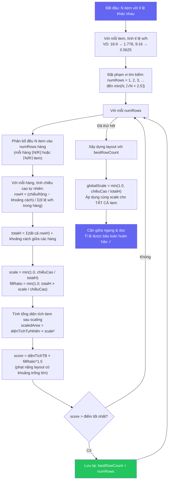
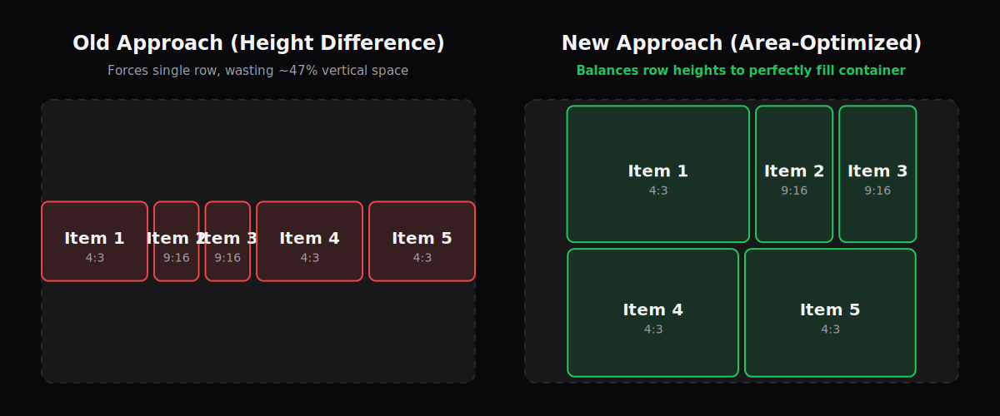

<p align="center">
  
  
  
  
</p>

<h1 align="center">Meeting Grid Layout</h1>

<p align="center">
  Thư viện grid responsive cho bố cục video meeting với animation mượt mà.
  <br />
  Hỗ trợ Vanilla JS, React và Vue.
</p>

<p align="center">
  <a href="#demos">Demos</a> ·
  <a href="#tính-năng">Tính năng</a> ·
  <a href="#các-gói">Các gói</a> ·
  <a href="#cài-đặt">Cài đặt</a> ·
  <a href="#bắt-đầu-nhanh">Bắt đầu nhanh</a> ·
  <a href="#chế-độ-layout">Chế độ layout</a> ·
  <a href="#api-reference">API Reference</a> ·
  <a href="#giấy-phép">Giấy phép</a>
</p>

<p align="center">
  <a href="./README.md">English</a>
</p>

---

## Demos

- [React Demo](https://meeting-react-grid.modern-ui.org/)
- [Vue Demo](https://meeting-vue-grid.modern-ui.org/)

---

## Tính năng

| Tính năng                  | Mô tả                                                  |
| -------------------------- | ------------------------------------------------------ |
| **2 chế độ layout**        | Gallery (có hỗ trợ ghim), Spotlight                    |
| **Ghim participant**       | Ghim bất kỳ participant nào làm view chính             |
| **Animation spring**       | Motion (Framer Motion / Motion One) khi chuyển layout  |
| **Phân trang**             | Chia participant qua nhiều trang                       |
| **Giới hạn hiển thị "+N"** | Giới hạn số item và hiển thị chỉ báo overflow          |
| **Tỉ lệ linh hoạt**        | Tỉ lệ riêng cho từng item (phone 9:16, desktop 16:9)   |
| **Floating PiP**           | Picture-in-Picture kéo thả, snap vào góc               |
| **Chế độ Pin Only**        | View pin mobile/tablet với phân trang riêng biệt      |
| **Grid Overlay**           | Overlay toàn grid cho screen sharing, whiteboard, v.v. |
| **Responsive**             | Tự động co giãn theo container với justified packing   |
| **Đa framework**           | Vanilla JS, React 18+, Vue 3                           |
| **TypeScript**             | Type đầy đủ                                            |
| **Tree-shakeable**         | Chỉ import phần cần dùng                               |

---

## Các gói

| Gói                                                                                                            | Mô tả                              | Dung lượng |
| -------------------------------------------------------------------------------------------------------------- | ---------------------------------- | ---------- |
| [`@thangdevalone/meeting-grid-layout-core`](https://www.npmjs.com/package/@thangdevalone/meeting-grid-layout-core)   | Chỉ tính toán grid (Vanilla JS/TS) | ~3KB       |
| [`@thangdevalone/meeting-grid-layout-react`](https://www.npmjs.com/package/@thangdevalone/meeting-grid-layout-react) | Component React + Motion           | ~8KB       |
| [`@thangdevalone/meeting-grid-layout-vue`](https://www.npmjs.com/package/@thangdevalone/meeting-grid-layout-vue)     | Component Vue 3 + Motion           | ~8KB       |

> Gói React và Vue đã re-export mọi thứ từ core — không cần cài core riêng.

---

## Cài đặt

```bash
# Chỉ core (Vanilla JavaScript/TypeScript)
npm install @thangdevalone/meeting-grid-layout-core

# React 18+
npm install @thangdevalone/meeting-grid-layout-react

# Vue 3
npm install @thangdevalone/meeting-grid-layout-vue
```

---

## Bắt đầu nhanh

### React

```tsx
import { GridContainer, GridItem } from '@thangdevalone/meeting-grid-layout-react'

function MeetingGrid({ participants }) {
  return (
    <GridContainer aspectRatio="16:9" gap={8} layoutMode="gallery" count={participants.length}>
      {participants.map((p, index) => (
        <GridItem key={p.id} index={index}>
          <VideoTile participant={p} />
        </GridItem>
      ))}
    </GridContainer>
  )
}
```

### Vue 3

```vue
<script setup>
import { GridContainer, GridItem } from '@thangdevalone/meeting-grid-layout-vue'

const participants = ref([...])
</script>

<template>
  <GridContainer aspect-ratio="16:9" :gap="8" :count="participants.length" layout-mode="gallery">
    <GridItem v-for="(p, index) in participants" :key="p.id" :index="index">
      <VideoTile :participant="p" />
    </GridItem>
  </GridContainer>
</template>
```

### Vanilla JavaScript

```javascript
import { createMeetGrid } from '@thangdevalone/meeting-grid-layout-core'

const grid = createMeetGrid({
  dimensions: { width: 800, height: 600 },
  count: 6,
  aspectRatio: '16:9',
  gap: 8,
  layoutMode: 'gallery',
})

for (let i = 0; i < 6; i++) {
  const { top, left } = grid.getPosition(i)
  const { width, height } = grid.getItemDimensions(i)

  element.style.cssText = `
    position: absolute;
    top: ${top}px;
    left: ${left}px;
    width: ${width}px;
    height: ${height}px;
  `
}
```

---

## Chế độ layout

| Chế độ      | Mô tả                                                         |
| ----------- | ------------------------------------------------------------- |
| `gallery`   | Grid linh hoạt lấp đầy không gian. Dùng `pinnedIndex` để ghim |
| `spotlight` | Một participant chiếm toàn bộ container                       |

### Gallery với ghim

Khi đặt `pinnedIndex`, layout chia thành **Vùng chính** (item được ghim) và **Vùng phụ** (thumbnail):

```tsx
<GridContainer
  layoutMode="gallery"
  pinnedIndex={0}              // Participant được ghim
  othersPosition="right"       // Thumbnail bên phải
  count={participants.length}
>
```

| `othersPosition` | Mô tả                              |
| ---------------- | ---------------------------------- |
| `right`          | Thumbnail bên phải (mặc định)      |
| `left`           | Thumbnail bên trái                 |
| `top`            | Thumbnail phía trên (dải ngang)    |
| `bottom`         | Thumbnail phía dưới (kiểu speaker) |

### Chế độ Pin Only

Trên thiết bị di động/tablet (chiều rộng container ≤ 1024px), `pinOnly` mang đến trải nghiệm tập trung:

- **Trang 0:** Chỉ hiển thị participant được ghim toàn màn hình
- **Trang 1+:** Các participant khác hiển thị dạng gallery grid (không có pin)

Trên desktop (chiều rộng > 1024px), layout hoạt động như sidebar bình thường.

```tsx
// React
<GridContainer
  layoutMode="gallery"
  pinnedIndex={0}
  maxVisible={4}
  currentVisiblePage={currentPage}
  pinOnly={true}
>
```

```vue
<!-- Vue -->
<GridContainer
  layout-mode="gallery"
  :pinned-index="0"
  :max-visible="4"
  :current-visible-page="currentPage"
  :pin-only="true"
>
```

> **Lưu ý:** `pinOnly` yêu cầu phân trang (`maxVisible > 0`) để hoạt động. Tổng số trang = 1 (trang pin) + ceil(others / maxVisible).

---

## Phân trang

Chia participant qua nhiều trang:

```tsx
<GridContainer
  count={participants.length}
  maxItemsPerPage={9}
  currentPage={currentPage}
>
```

Với chế độ ghim, dùng `maxVisible` và `currentVisiblePage` để phân trang vùng "others":

```tsx
<GridContainer
  layoutMode="gallery"
  pinnedIndex={0}
  maxVisible={4}
  currentVisiblePage={othersPage}
>
```

---

## Giới hạn hiển thị "+N thêm"

Giới hạn số item hiển thị và hiện chỉ báo overflow:

```tsx
<GridContainer maxVisible={4} count={12}>
  {participants.map((p, index) => (
    <GridItem key={p.id} index={index}>
      {({ isLastVisibleOther, hiddenCount }) => (
        <>
          {isLastVisibleOther && hiddenCount > 0 ? (
            <div className="more-indicator">+{hiddenCount} thêm</div>
          ) : (
            <VideoTile participant={p} />
          )}
        </>
      )}
    </GridItem>
  ))}
</GridContainer>
```

---

## Tỉ lệ linh hoạt

Hỗ trợ tỉ lệ khác nhau cho từng participant (ví dụ: mobile dọc vs desktop ngang):

```tsx
const itemAspectRatios = [
  "16:9",    // Desktop ngang
  "9:16",    // Mobile dọc
  undefined, // Dùng aspectRatio chung
]

<GridContainer
  aspectRatio="16:9"
  itemAspectRatios={itemAspectRatios}
>
```

| Giá trị     | Mô tả                                              |
| ----------- | -------------------------------------------------- |
| `"16:9"`    | Tỉ lệ ngang cố định                                |
| `"9:16"`    | Video dọc (điện thoại)                             |
| `"4:3"`     | Tỉ lệ tablet cổ điển                               |
| `"auto"`    | Co giãn lấp đầy cell (mặc định khi không chỉ định) |
| `undefined` | Sử dụng global `aspectRatio`                       |

### Thuật toán Gallery linh hoạt

Khi các participant có **tỉ lệ khác nhau** (ví dụ: điện thoại 9:16, máy tính 16:9), grid sử dụng thuật toán **Tìm kiếm hàng tối ưu theo diện tích** để tìm bố cục tận dụng không gian tốt nhất mà vẫn giữ đúng tỉ lệ.

#### Vấn đề của Greedy Packing

Cách tiếp cận đơn giản là xếp item vào hàng cho đến khi hàng "đầy" rồi xuống hàng mới. Cách này thường tạo ra **layout lệch** — ví dụ 10 item có thể thành `[4, 5, 1]`, hàng cuối chỉ có 1 item lẻ loi và lãng phí rất nhiều không gian.

Cách tiếp cận so sánh chiều cao (`|totalH − chiềuCao|`) cũng thất bại với tỉ lệ hỗn hợp — nó có xu hướng chọn layout 1 hàng để lại khoảng trống dọc rất lớn (VD: 3×4:3 + 2×9:16 tất cả trong 1 hàng).

Thuật toán của chúng tôi tránh cả hai vấn đề bằng cách **chấm điểm mỗi bố cục dựa trên diện tích sử dụng thực tế**, có trọng số theo mức lấp đầy container.

#### Sơ đồ thuật toán



#### Các bước chi tiết

1. **Tính tỉ lệ w/h** — Với mỗi item, chuyển aspect ratio thành số:
   - `16:9` → `1.778` (ngang rộng)
   - `9:16` → `0.5625` (dọc cao)
   - `4:3` → `1.333`, `1:1` → `1.0`

2. **Đặt phạm vi tìm kiếm** — Thử mọi số hàng từ `1` đến `min(N, ⌈√N × 2.5⌉)`. Bỏ qua số hàng mà `⌊N/numRows⌋ = 0` (sẽ tạo hàng rỗng).

3. **Phân bổ đều** — Với mỗi `numRows`, item được chia đều:
   - `base = ⌊N / numRows⌋`, `extra = N % numRows`
   - `extra` hàng đầu nhận `base + 1` item, các hàng còn lại nhận `base` item
   - Ví dụ: 9 item chia 2 hàng → `[5, 4]`; chia 4 hàng → `[3, 2, 2, 2]`

4. **Tính chiều cao tự nhiên mỗi hàng** — Nếu một hàng item lấp đầy chiều rộng container, nó cao bao nhiêu?
   ```
   rowHeight = (chiềuRộng − (sốItem − 1) × gap) / Σ(tỉ lệ w/h của item trong hàng)
   ```
   Hàng có item dọc/cao sẽ cho chiều cao lớn; hàng có item ngang/rộng cho chiều cao nhỏ.

5. **Chấm điểm dựa trên diện tích** — Với mỗi ứng viên:
   - Tính `scale = min(1.0, chiềuCao / totalH)` — item cần thu nhỏ bao nhiêu để vừa
   - Tính `fillRatio = min(1.0, totalH × scale / chiềuCao)` — bao nhiêu không gian dọc thực sự được sử dụng
   - Tính `diệnTíchTB = tổngDiệnTích × scale² / N` — diện tích trung bình mỗi item sau scaling
   - **Score = `diệnTíchTB × fillRatio^1.5`** — cân bằng giữa kích thước item và tận dụng không gian. Số mũ `fillRatio^1.5` phạt mạnh layout có khoảng trống lớn (VD: 1 hàng chỉ dùng 60% chiều cao → bị phạt 0.46×).

6. **Chọn kết quả** — Số hàng có **score cao nhất** thắng. Điều này tự nhiên cân bằng:
   - Ít hàng → item lớn hơn nhưng có thể lãng phí dọc (fillRatio thấp → bị phạt)
   - Nhiều hàng → lấp đầy tốt hơn nhưng scaling nặng (diệnTíchTB nhỏ)

7. **Scale đều** — Áp dụng một hệ số `globalScale = min(1.0, chiềuCao / totalH)` cho **tất cả** item. Vì chiều rộng và chiều cao scale cùng hệ số, tỉ lệ của mỗi item được **bảo toàn hoàn hảo**.

8. **Căn giữa & đặt vị trí** — Mỗi hàng được căn giữa theo chiều ngang, toàn bộ grid được căn giữa theo chiều dọc trong không gian còn lại.

#### Tại sao chọn `√N × 2.5` làm giới hạn trên?

Phạm vi tìm kiếm `⌈√N × 2.5⌉` được chọn cẩn thận:

- **`√N` là baseline "lưới vuông".** Với N item trong grid đều, `√N` hàng × `√N` cột là cách sắp xếp tự nhiên. Ví dụ: 9 item → 3×3, 16 item → 4×4.

- **Tỉ lệ hỗn hợp có thể cần nhiều hàng hơn.** Khi tất cả item là dọc/cao (VD: 9:16), xếp cạnh nhau chiếm rất nhiều chiều rộng — có thể cần nhiều hàng hơn `√N` để tận dụng chiều cao container.

- **Hệ số `2.5×` cung cấp đủ dư địa.** Cho phép tìm kiếm vượt xa baseline căn bậc hai để xử lý trường hợp nhiều item dọc, mà không lãng phí:

  | N (item) | √N   | ⌈√N × 2.5⌉ | Số hàng thử tối đa |
  | -------- | ---- | ----------- | ------------------- |
  | 4        | 2.0  | 5           | 4 (giới hạn tại N)  |
  | 9        | 3.0  | 8           | 8                   |
  | 16       | 4.0  | 10          | 10                  |
  | 25       | 5.0  | 13          | 13                  |
  | 50       | 7.07 | 18          | 18                  |

- **`min(N, ...)` giới hạn tối đa.** Không bao giờ cần nhiều hàng hơn số item. Với N nhỏ (VD: 4 item), `⌈√4 × 2.5⌉ = 5` bị giới hạn còn `4`.

#### So sánh trước và sau

<p align="center">
  
</p>

#### Ví dụ trực quan: 5 item với tỉ lệ hỗn hợp (3×4:3, 2×9:16)

```
Container: 1024 × 460px
Tỉ lệ: 4:3, 9:16, 9:16, 4:3, 4:3
Phạm vi tìm: 1 đến min(5, ⌈√5 × 2.5⌉) = min(5, 6) = 5

Chấm điểm theo diện tích:
┌───────────────────────────────────────────────────────────────────────────────────────┐
│ Rows=1: [5]      scale=1.00  fillRatio=0.53  diệnTíchTB=61K  score=23.6K  ❌        │
│ Rows=2: [3, 2]   scale=0.47  fillRatio=1.00  diệnTíchTB=42K  score=42.0K  ✅        │
│ Rows=3: [2,2,1]  scale=0.27  fillRatio=1.00  diệnTíchTB=18K  score=18.0K  ❌        │
└───────────────────────────────────────────────────────────────────────────────────────┘

Thắng: 2 hàng [3, 2]
  → Item được phân bố qua 2 hàng, lấp đầy chiều cao container tốt
  → Không còn khoảng trống lớn phía trên/dưới ✓

Thuật toán cũ sẽ chọn Rows=1 (chiều cao gần nhất), để lại ~47% không gian dọc trống.
```

#### Hiệu năng

| Chỉ số                | Giá trị                                                        |
| --------------------- | -------------------------------------------------------------- |
| Độ phức tạp thời gian | `O(N × √N)` — N item × tối đa √N×2.5 ứng viên                |
| Bộ nhớ                | `O(N)` — chỉ cấp phát mảng cho phương án thắng                |
| Pha tìm kiếm          | Không cấp phát bộ nhớ — chỉ tính arithmetic trên mảng tỉ lệ   |
| Tốc độ thực tế        | < 0.1ms cho 50 participant                                     |

---

## Floating PiP (Picture-in-Picture)

Item nổi kéo thả, snap vào góc. Hỗ trợ kích thước cố định hoặc responsive.

```tsx
import { FloatingGridItem, DEFAULT_FLOAT_BREAKPOINTS } from '@thangdevalone/meeting-grid-layout-react'

<GridContainer>
  {/* Các grid item chính */}

  {/* Kích thước cố định */}
  <FloatingGridItem width={130} height={175} anchor="bottom-right">
    <VideoTile participant={floatingParticipant} />
  </FloatingGridItem>

  {/* Responsive — tự điều chỉnh theo chiều rộng container */}
  <FloatingGridItem breakpoints={DEFAULT_FLOAT_BREAKPOINTS}>
    <VideoTile />
  </FloatingGridItem>
</GridContainer>

{/* Auto-float chế độ 2 người */}
<GridContainer count={2} floatBreakpoints={DEFAULT_FLOAT_BREAKPOINTS}>
  {participants.map((p, i) => (
    <GridItem key={p.id} index={i}><VideoTile participant={p} /></GridItem>
  ))}
</GridContainer>

{/* Chọn participant nào làm floating PiP */}
<GridContainer count={2} floatBreakpoints={DEFAULT_FLOAT_BREAKPOINTS} pipIndex={0}>
  {participants.map((p, i) => (
    <GridItem key={p.id} index={i}><VideoTile participant={p} /></GridItem>
  ))}
</GridContainer>
```

### Breakpoints mặc định

| Chiều rộng container | Kích thước PiP |
| -------------------- | -------------- |
| 0 – 479px            | 100 × 135      |
| 480 – 767px          | 130 × 175      |
| 768 – 1023px         | 160 × 215      |
| 1024 – 1439px        | 180 × 240      |
| 1440px+              | 220 × 295      |

Tự định nghĩa breakpoints với `PipBreakpoint[]`:

```tsx
const myBreakpoints: PipBreakpoint[] = [
  { minWidth: 0, width: 80, height: 110 },
  { minWidth: 600, width: 150, height: 200 },
  { minWidth: 1200, width: 250, height: 330 },
]

<FloatingGridItem breakpoints={myBreakpoints}>...</FloatingGridItem>
// hoặc
<GridContainer count={2} floatBreakpoints={myBreakpoints}>...</GridContainer>
```

> **Lưu ý:** Props `width`/`height` cố định ghi đè breakpoints. Hệ thống chọn breakpoint có `minWidth` lớn nhất mà ≤ chiều rộng container.

### `pipIndex` — Chọn participant làm PiP

Trong chế độ 2 người, `pipIndex` chọn participant nào sẽ hiển thị dạng floating PiP (người còn lại chiếm toàn bộ màn hình). Mặc định là `1` (participant thứ 2).

| `pipIndex`     | Chính (toàn màn hình) | Floating PiP    |
| -------------- | --------------------- | --------------- |
| `0`            | Participant 1         | Participant 0   |
| `1` (mặc định) | Participant 0         | Participant 1   |

### `disableFloat` — Tắt PiP tự động

Đặt `disableFloat={true}` để tắt Floating PiP tự động trong chế độ 2 người. Khi tắt, cả hai participant sẽ hiển thị dạng gallery grid chuẩn thay vì một toàn màn hình + một PiP kéo thả.

```tsx
// Chế độ 2 người bình thường (PiP bật mặc định)
<GridContainer count={2}>...</GridContainer>

// Tắt PiP — hiển thị gallery grid chuẩn với 2 ô
<GridContainer count={2} disableFloat={true}>...</GridContainer>
```

### Props của `GridOverlay`

| Prop              | Kiểu                 | Mặc định            | Mô tả                      |
| ----------------- | -------------------- | ------------------- | -------------------------- |
| `visible`         | `boolean`            | `true`              | Hiển thị overlay hay không |
| `backgroundColor` | `string`             | `'rgba(0,0,0,0.5)'` | Màu nền overlay            |
| `children`        | `ReactNode` / `slot` | -                   | Nội dung bên trong overlay |

---

## Phát triển

```bash
git clone https://github.com/thangdevalone/meeting-grid-layout.git
cd meeting-grid-layout

pnpm install
pnpm build

# Chạy demo
pnpm dev
# React: http://localhost:5173
# Vue: http://localhost:5174
```

Cấu trúc dự án:

```
meeting-grid-layout/
├── packages/
│   ├── core/       # Logic grid (không phụ thuộc framework)
│   ├── react/      # React component + hooks
│   └── vue/        # Vue 3 component + composables
├── examples/
│   ├── react-demo/
│   └── vue-demo/
└── package.json
```

---

## Giấy phép

MIT © [@thangdevalone](https://github.com/thangdevalone)

Xem [LICENSE](./LICENSE) để biết chi tiết.
